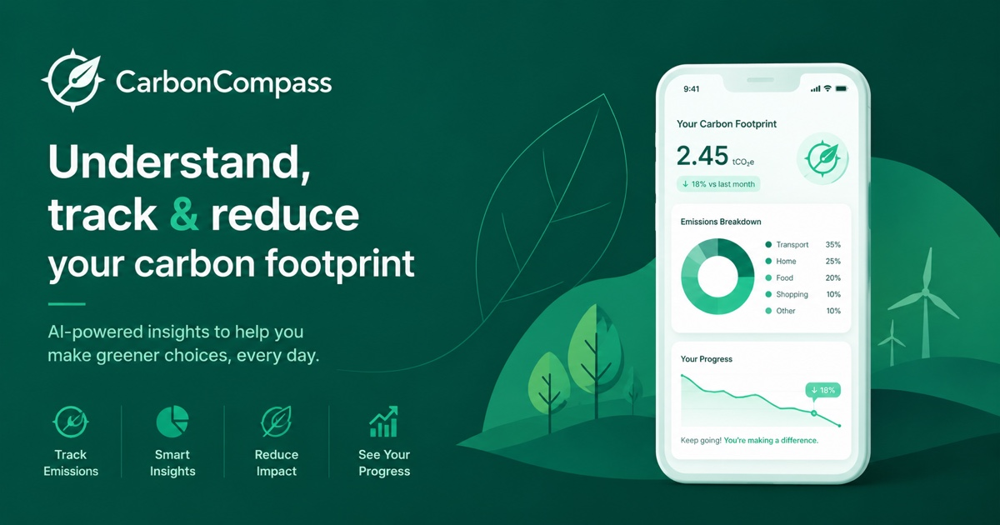
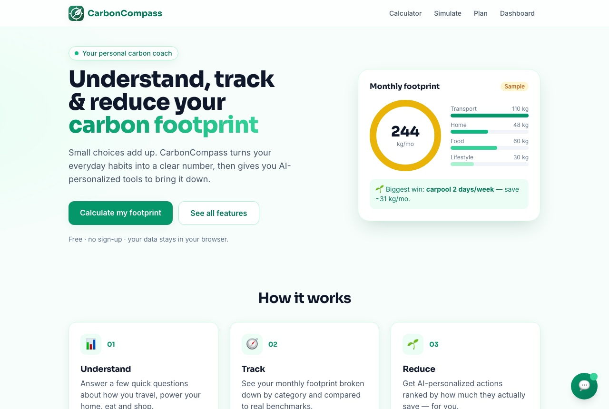
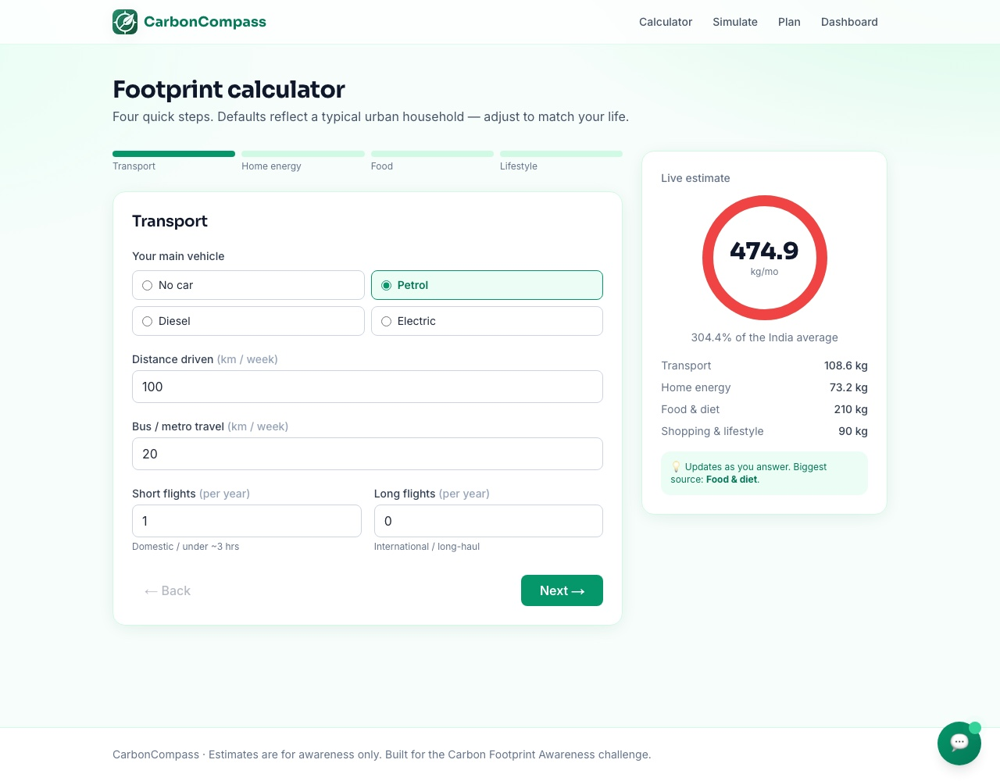
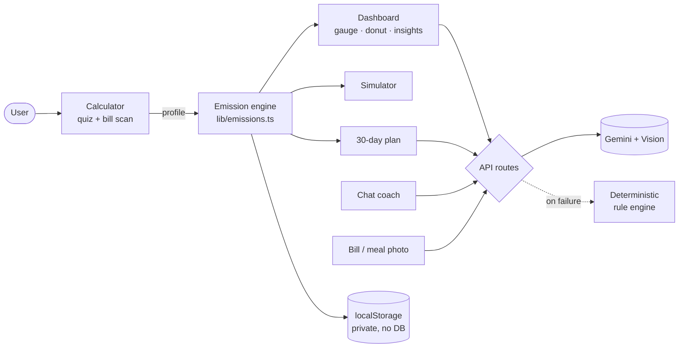

# 🧭 CarbonCompass

[](https://github.com/Mehulkoshti/carbon-compass/actions/workflows/ci.yml)


**Understand, track and reduce your personal carbon footprint — with AI-powered, context-aware guidance.**



CarbonCompass turns a person's everyday habits (how they travel, power their home,
eat and shop) into a clear monthly CO₂e number, shows where it comes from, and gives
them an AI coach, a what-if simulator and a 30-day plan to bring it down — all in a
fast, installable, accessible web app.

> Built for the **Carbon Footprint Awareness Platform** challenge.

---

## ✨ Highlights

- 🧮 **State-aware calculator** — a 4-step quiz that uses your **state's real grid
  emission factor** for an accurate number.
- 📸 **Bill & meal scanning** — Gemini **Vision** reads your electricity bill's kWh
  and estimates a meal's food carbon from a photo.
- 🧭 **Visual dashboard** — animated gauge, donut breakdown, benchmarks.
- 🌱 **AI insights + 💬 grounded chat coach** — answers based on *your* numbers,
  never generic; degrades gracefully to a deterministic engine if AI is down.
- 🎚️ **What-if simulator** — slide through EV / diet / solar / travel and watch your
  footprint re-project live.
- 🗓️ **AI 30-day plan** — a checkable, week-by-week reduction roadmap.
- 📈 **History, streaks, goals & 🏅 achievements** — habit-building gamification.
- 📤 **Shareable result card**, installable **PWA**, full **accessibility**.

| Landing | Calculator (live estimate) |
|---|---|
|  |  |

---

## 1. Chosen vertical

**Persona: the everyday urban individual** who wants to live more sustainably but
doesn't know *where they stand* or *which single change matters most*. Generic advice
doesn't help them prioritize. CarbonCompass is a fast, friendly, jargon-free coach
built around that persona — meeting the brief head-on: **understand → track → reduce,
through simple actions and personalized insights.**

## 2. Approach & logic

The core design decision is **separation of maths from language**:

- A pure, fully unit-tested **emission engine** (`lib/emissions.ts`) computes the
  footprint from published factors (IPCC, India CEA grid factor, DEFRA, Our World in
  Data) — using **state-level grid intensity** for electricity.
- A **reduction-action engine** (`lib/actions.ts`) estimates, *for the specific user*,
  how much each action saves by re-running the engine — so "carpool 2 days/week" saves
  a heavy commuter far more than someone who already takes the metro. **This is the
  context-aware decision-making the challenge asks for.**
- **Gemini** only does *framing and prioritization* (insights, chat, plan) and
  **Vision** for image understanding (bill/meal). It never invents the numbers, so
  output stays grounded and reproducible.
- Every AI path **degrades gracefully** to a deterministic rule-based engine, so the
  product — and the live demo — never breaks.

## 3. Architecture



```
app/
  page.tsx                 Landing (feature showcase)
  calculator/page.tsx      4-step quiz + bill scan + live estimate
  simulate/page.tsx        What-if scenario simulator
  plan/page.tsx            AI 30-day plan (checkable)
  dashboard/page.tsx       Gauge · donut · insights · actions · streaks · badges · meal scan
  api/insights|chat|plan|scan-bill|scan-meal/route.ts   Server routes (Gemini, key server-side)
  opengraph-image.jpg · icon.png · apple-icon.png · manifest.ts   Branding / PWA
lib/
  emissions.ts   Pure engine + factors          ← tested
  actions.ts     Context-aware reduction actions ← tested
  states.ts      State-wise grid factors         ← tested
  history.ts     Streaks / goals / trend         ← tested
  achievements.ts · plan.ts   Badges & plan logic ← tested
  insights.ts    Rule-based fallback coach
  gemini.ts      Shared Gemini wrapper (model fallback)
  ratelimit.ts · schema.ts · storage.ts
components/       Accessible UI (gauge, donut, chat, charts, trackers, toasts, nav)
__tests__/        58 Vitest tests (unit + API + component)
.github/workflows/ci.yml   Lint · test · build on every push
```

## 4. How each evaluation criterion is met

| Criterion | How it's addressed |
|---|---|
| **Problem alignment** (High) | Full understand → track → reduce loop: calculator, dashboard, AI insights/chat, simulator, 30-day plan, streaks. Personalization is computed per-user. |
| **Code quality** (High) | Strict TypeScript, pure & documented functions, clear `lib`/`components`/`api` separation, a shared Gemini wrapper, no dead code. |
| **Security** | API keys server-only; **Zod** validation on every route; per-IP rate limiting; security headers; image type/size limits; no secrets in repo (`.env.example`). |
| **Efficiency** | No chart library (custom SVG), client-side persistence (no DB), `next/font` + `next/image`, AI response kept small & cached-friendly, graceful fallbacks. |
| **Testing** | **58 tests**: engine, actions, states, streaks/goals, achievements, plan + **API-route tests** (Gemini mocked) + **component tests**. Run in CI. |
| **Accessibility** | Semantic HTML, ARIA, keyboard nav, skip link, focus management (chat returns focus), screen-reader data tables for charts, AA contrast, reduced-motion, safe-area-aware mobile tab bar. |

## 5. Tech stack

Next.js 14 (App Router) · TypeScript (strict) · Tailwind CSS · Zod · Google **Gemini**
(text + Vision) · Vitest + Testing Library · deployed on Vercel.

## 6. Testing

```bash
npm test          # 58 tests (unit + API + component)
```

- **Engine/logic**: emission maths, per-user action savings, state factors, streaks,
  goal progress, achievements, plan generation.
- **API routes**: success + validation (422) + bad-body (400) + AI-unavailable
  fallback paths, with Gemini mocked (no network in tests).
- **Components**: chart accessibility table, form interactions, tracker behaviour.

CI (`.github/workflows/ci.yml`) runs **lint + tests + build** on every push.

## 7. Security & privacy

- Gemini API key lives only in a server env var; it never reaches the browser.
- All request bodies validated with Zod; numeric ranges bounded.
- In-memory per-IP rate limiting on every AI route.
- Security headers (`X-Content-Type-Options`, `X-Frame-Options`, `Referrer-Policy`,
  `Permissions-Policy`).
- **No account, no database** — your data stays in your browser's `localStorage`.

## 8. Accessibility

Keyboard-navigable throughout, visible focus rings, a skip link, ARIA labelling,
screen-reader data tables behind every chart, `aria-live` for dynamic updates, focus
return when the chat closes, WCAG-AA contrast, `prefers-reduced-motion` support, and an
app-style bottom tab bar with safe-area insets on mobile.

## 9. Getting started

```bash
npm install
cp .env.example .env.local      # add your free Gemini key from aistudio.google.com/apikey
npm run dev                     # http://localhost:3000
npm test                        # run the test suite
npm run build                   # production build
```

> The app works **without** a key (rule-based fallback); the key upgrades insights,
> chat and image scanning to live AI.

## 10. Deployment (Vercel)

1. Push to a public GitHub repo (single `main` branch).
2. Import in Vercel — framework auto-detected (Next.js).
3. Add env vars: `GEMINI_API_KEY`, optionally `GEMINI_MODEL`, and
   `NEXT_PUBLIC_SITE_URL` (your deployed URL, for correct social-share image links).
4. Deploy.

## 11. Assumptions

- Emission factors are India-leaning, rounded estimates for **awareness**, not
  certified accounting.
- Household electricity & cooking gas are split evenly across household members.
- Food/shopping use representative averages per diet/habit to keep the quiz under a
  minute.
- Flight figures use round per-flight values inclusive of radiative forcing.

---

*Estimates are for awareness only and should not be treated as certified carbon accounting.*
